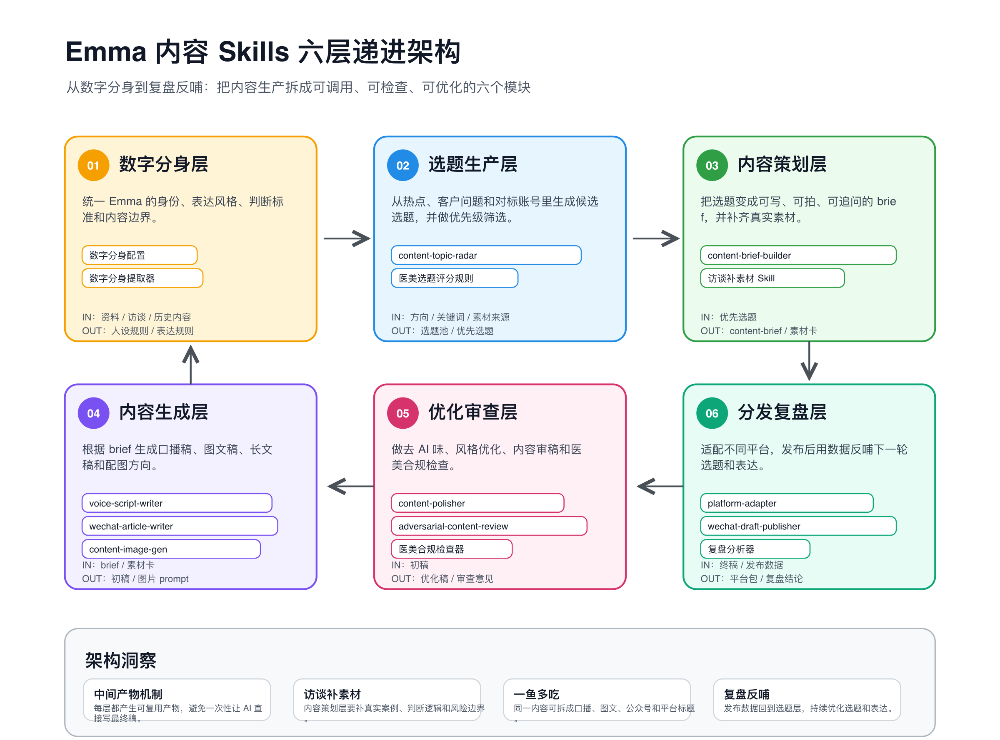

# self-media-system

Emma 自媒体六层内容生产系统 Skill 套件。它把一次内容生产拆成数字分身、选题生产、内容策划、内容生成、优化审查、分发复盘六层，避免直接让 AI 一步写最终稿。



## 适合谁用

- 想用 Codex / OpenClaw 按固定流程生产自媒体内容的人。
- 需要把人设、选题、成稿、审稿、合规、平台适配拆开管理的账号。
- 需要把公众号、小红书、视频号内容沉淀成可复用工作流的团队。

## 快速安装

推荐安装到 Codex 默认 Skill 目录：

```bash
git clone https://github.com/Abigale-cyber/self-media-system.git
cd self-media-system
./install.sh
```

安装后目录应为：

```text
~/.agents/skills/self-media-system/
```

手动安装也可以：

```bash
mkdir -p ~/.agents/skills
cp -R self-media-system ~/.agents/skills/self-media-system
```

验证安装：

```bash
find ~/.agents/skills/self-media-system -name SKILL.md | sort
```

如果使用 Claude Code，可安装到：

```bash
./install.sh --target "$HOME/.claude/skills/self-media-system"
```

## 环境配置

大部分 Skill 不需要密钥。只有生图和公众号草稿箱相关能力需要本地配置。

```bash
mkdir -p ~/.self-media-system
cp .env.example ~/.self-media-system/.env
```

按需填写：

| 变量 | 用途 | 必填 |
| --- | --- | --- |
| `ARK_API_KEY` | `content-image-gen` 调用豆包 Seedream 生图 | 生图时必填 |
| `SEEDREAM_IMAGE_MODEL` | Seedream 模型名 | 否 |
| `SEEDREAM_BASE_URL` | ARK API 地址 | 否 |
| `WECHAT_APP_ID` | 公众号草稿箱推送 | 推送草稿箱时必填 |
| `WECHAT_APP_SECRET` | 公众号草稿箱推送 | 推送草稿箱时必填 |

## 六层架构

| 层级 | 目标 | 对应 Skill |
| --- | --- | --- |
| 01 数字分身层 | 统一账号定位、人设口吻、专业边界和禁用表达。 | `digital-avatar` |
| 02 选题生产层 | 访谈补素材、生成候选选题、按优先级排序。 | `interview-to-draft`, `content-topic-radar`, `topic-score-ranker` |
| 03 内容策划层 | 把确定选题改写成可确认、可成稿、可拍摄的大纲。 | `content-outline-builder` |
| 04 内容生成层 | 生成口播稿、视频脚本、公众号长文和配图。 | `outline-to-script`, `voice-script-writer`, `wechat-article-writer`, `content-image-gen` |
| 05 优化审查层 | 做标题开头优化、内容审稿和医美合规检查。 | `content-polisher`, `adversarial-content-review`, `medical-aesthetic-compliance-checker` |
| 06 分发复盘层 | 适配平台发布包，并进入公众号工作台预览确认。 | `platform-adapter`, `wechat-studio` |

## Skill 清单

| Skill | 路径 | 作用 | 典型输出 |
| --- | --- | --- | --- |
| `self-media-system` | `SKILL.md` | 总入口。判断当前内容生产阶段，并路由到最具体的子 Skill。 | 下一步 Skill 建议、完整流程说明 |
| `digital-avatar` | `01-digital-avatar/` | 固定 Emma 的账号身份、受众、语气、专业边界和禁用表达。 | 人设规则、表达边界 |
| `interview-to-draft` | `02-interview-to-draft/` | 用户只有方向但素材不足时，先做资料盘点和访谈追问。 | `topic-material-pack.md` |
| `content-topic-radar` | `02-content-topic-radar/` | 基于素材和必要外部信号生成候选选题。 | `topic-pool.md` |
| `topic-score-ranker` | `02-topic-score-ranker/` | 对候选选题排序、淘汰和推荐优先执行题。 | Top 3 选题、评分理由 |
| `content-outline-builder` | `03-content-outline-builder/` | 把明确选题整理成文章或视频可用的大纲。 | `content-outline.md` |
| `outline-to-script` | `04-outline-to-script/` | 把大纲转成短视频口播稿、轻量分镜和封面标题。 | 视频脚本、分镜建议 |
| `voice-script-writer` | `04-voice-script-writer/` | 把公众号文章改成 60s / 90s / 180s 口播逐字稿。 | 口播稿 |
| `wechat-article-writer` | `04-wechat-article-writer/` | 按已确认大纲写公众号长文，并自动衔接审稿。 | `article-draft.md` |
| `content-image-gen` | `04-content-image-gen/` | 生成封面图、正文配图或可复制图片 Prompt。 | 图片文件、图片 Prompt |
| `adversarial-content-review` | `05-adversarial-content-review/` | 三角色对抗式审稿，检查逻辑、表达、用户感受和改稿空间。 | `review-report.md` |
| `content-polisher` | `05-content-polisher/` | 优化标题、开头、结尾和句子表达，降低 AI 味。 | 润色稿、标题备选 |
| `medical-aesthetic-compliance-checker` | `05-medical-aesthetic-compliance-checker/` | 检查疗效承诺、绝对化表达、焦虑营销、资质暗示和风险提示。 | `compliance-report.md` |
| `platform-adapter` | `06-platform-adapter/` | 把终稿适配成小红书、视频号、公众号发布包。 | `publish-pack.md` |
| `wechat-studio` | `06-wechat-studio/` | 本地公众号工作台，用于 Markdown 导入、HTML 预览、主题调整和草稿箱确认。 | 本地预览、公众号草稿 |

## 标准流程

```text
digital-avatar
-> interview-to-draft
-> content-topic-radar
-> topic-score-ranker
-> content-outline-builder
-> wechat-article-writer / outline-to-script / voice-script-writer
-> content-polisher
-> adversarial-content-review
-> medical-aesthetic-compliance-checker
-> platform-adapter
-> wechat-studio
```

用户直接输入 `/选题` 或“我想做一个关于 XX 的内容”时，默认先走：

```text
interview-to-draft -> content-topic-radar -> topic-score-ranker
```

资料不足时先追问，不直接进入写稿。

## 公众号工作台

`wechat-studio` 是可选本地工作台。安装依赖并启动：

```bash
cd ~/.agents/skills/self-media-system/06-wechat-studio/frontend
npm install
python3 server.py
```

打开：

```text
http://127.0.0.1:4173
```

草稿箱推送依赖 `wechat-article-workflow` 的渲染与微信接口脚本。若安装在非默认位置，启动前设置：

```bash
export WECHAT_ARTICLE_WORKFLOW_SCRIPTS=/path/to/wechat-article-workflow/scripts
```

## 发布包说明

这个仓库只包含可公开分发的 Skill、共享规则、脚本和工作台源码，不包含：

- `.env`、API Key、token、cookie。
- `06-wechat-studio/content/` 下的本地文章工作区。
- `06-wechat-studio/AI/` 下的生成图片、预览 HTML 和临时签名 URL。
- `node_modules/`、虚拟环境、缓存文件。

这些运行态内容会在安装后由本地环境生成。
